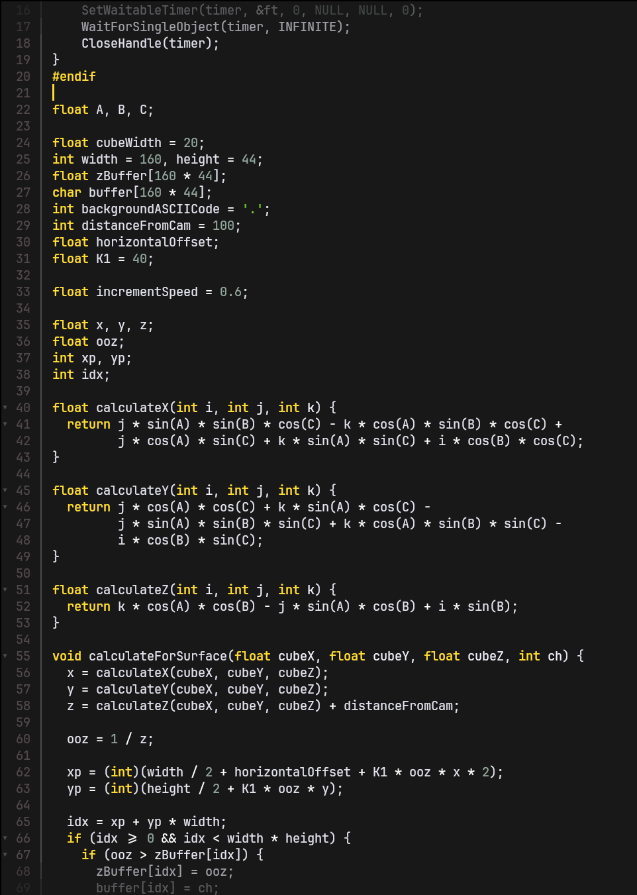

# Gruber Darker Theme for Fresh Text Editor

It needs to be a little more polished to be the same theme as made by Alexy Kutepov a.k.a. rexim [real gruber-darker-theme](https://github.com/rexim/gruber-darker-theme).

# Screenshot

# Installation
1. Locate your Fresh Editor themes directory (usually in the editor's configuration folder `${HOME}/.config/fresh/themes/`)
2. Copy the desired them JSON file to the themes directory
3. Restart Fresh Editor or reload the theme settings
4. Select the theme from the editor's theme picker or stablish it by yourself in the `${HOME}/.config/fresh/config.json`
